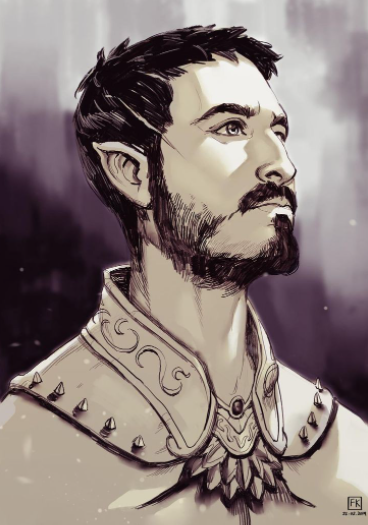
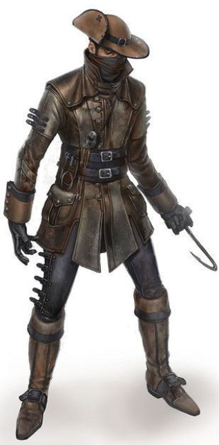

|       |  |
|:----------------------------------------------------------------------------------------------:| :-----: |
| *Astor Serbine* | *"Retalho"* | 

Astor "Retalho" Serbine vivia com sua família da Casa Serbine, família de magos influentes na cidade de Brimia, localizada a 250km ao sul do reino de Aretuza, erá um jovem espontâneo e boêmio, vivia pelo prazer de se viver sendo a sua máxima “não há paixão maior do que eu sinto pela vida”, inteligente por mais que desinteressado no meio acadêmico, sua formação como um homem letrado vêm por imposição familiar, mas ele encontrou uma paixão nas letras, os poemas… e as pessoas.

Sua família é uma geração posterior de uma das 3 casas fundadoras dessa escola, e seu pai Faelar Serbine especificamente focava no estudo da ciência e biologia. 

Havia muito conflito entre as casas fundadoras, a escolha do reitor basicamente determinava uma das casas como superior e ao resto a inferioridade, Faelar conseguiu tal título com facilidade, entretanto fora do conhecimento de seu pai Astor vivia um romance com Robert Ashcut, um jovem brilhante versado no mundo mágico e com uma boa alma, Astor se viu intrigado e apaixonado pelo filho da casa Ashcut uma das três fundadoras. O pai de Robert, o arqueólogo Pier ao descobrir nesse caso se enfurece, essa tinha sido a última facada em seu ego, e secretamente manda matar Astor, o jovem enquanto caminhava pelas ruas da cidade aproveitando a luz do luar é pego pelas costas e sua garganta é cortada e em seu ouvido ouviu o sussurro “A Casa Ashcut manda suas lembranças”, o agora Retalho carrega ainda hoje as cicatrizes emocionais e físicas mesmo depois da morte. 

Em uma atitude desesperada Faelar, utiliza de métodos secretos da biologia e do Aether para reviver Astor, porém a Casa Ashcut descobre de seus planos e envia um pelotão pro laboratório do seu pai, forçando a fugir pela sua vida, e finalmente Pier Ashcut se tornara reitor…

Retalho acorda, com uma carta e uma passagem do porto de Keville com destino a Khal Lodar, e desde então vaga pelas ruas confuso em direção ao porto de Keville em buscas de respostas de quem ele é e de o que aconteceu, Astor morreu e quem vive agora é o Retalho, sem memórias de sua vida passada a não ser flashs e a eterna sensação da dor de ter sua garganta cortada, Retalho vive agora mais como coisa do que como homem porém acredita que deva existir uma razão para sua existência, algo de bom a ser feito no mundo.

