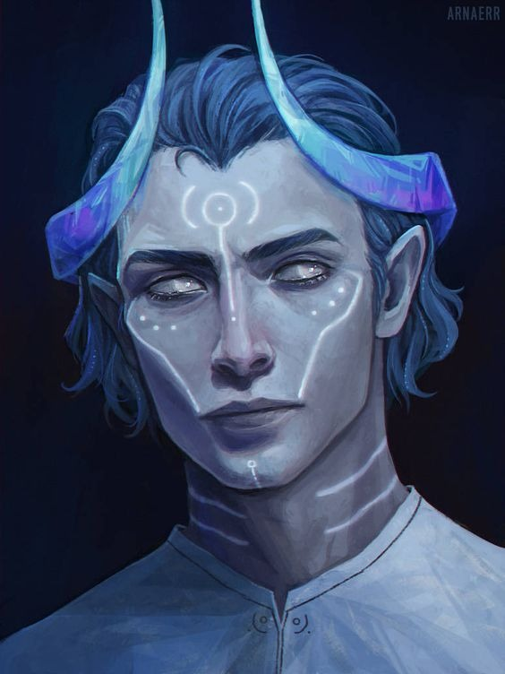

||
|:---:|
| *Galahad Sanguine* | 

> *...Galahad então entendeu uma peça crucial que estava faltando em sua fé, a paz é a única forma de nos sentirmos realmente humanos*

 

Desde o primeiro contato dos elfos nas terras das grandes florestas místicas de Kaen’Shaed, algo macabro e escuro se escondia na feywild, Blightmore, uma das sociedades mais antigas de Aretuza formada apenas por hags, por mais de um milênio assombra uma certa parte do norte das florestas do primeiro lar dos Elfos, muitos desaparecimentos ocorrem nesta região e nunca nenhuma vítima desses sumiços foi encontrada, esses desaparecimentos tem uma peculiaridade, apenas homens parecem se perder no fundo da floresta de Mighty Spruce Covert, e muitos deles tem o destino pior que a morte, as hags capturam os homens para simplesmente poderem reproduzir e para rituais, filhos de hags com homens são chamados de Hexbloods, pois ainda não tem o poder total de uma hag em sua fase de crescimento, Hexbloods tem traços mais “humanos” normalmente nascem com marcas por todo seu corpo e com um par de chifres que saem da parte de trás de sua cabeça, alguns homens, por estarem com muito medo de morrer acabam cedendo a fazer um pacto, muitos  deles morrem durante as insanidades que acontecem durante o ritual, os que sobrevivem acabam perdendo sua humanidade e se transformam em hags ao passar dos anos. Durante anos e anos hags fazem estes eventos diabólicos, porém o nascimento de uma criança iria trazer sanidade de volta a hag Isis Nox.

Certo dia mais uma vítima foi feita em Mighty Spruce Covert, dessa vez era um humano, uma especiaria rara dado que em Kaen’Shaed a população é majoritariamente élfica, Isis Nox que o sequestrou e trouxe o pobre rapaz para Blightmore, até que ela o ofereceu a fazer um pacto por sua vida, ele propôs uma contraoferta que chamou a atenção da hag, “Com o nascimento de nosso filho, sua sanidade retornara”, ela riu, riu como nunca tinha rido sua vida inteira e aceitou o pacto, Isis já tinha se tornado uma hag há séculos, já havia se esquecido como era ter algum resquício de sanidade, e pactos sempre são cumpridos. O fatídico dia chegou e a criança que viria a ser Galahad Sanguine nasceu, Spes foi o nome dado por sua mãe, e para Isis foi como ela tivesse finalmente retomado a consciência, ela se viu segurando seu filho em um ambiente totalmente insano, e tinha que tirar seu filho dali o mais rápido possível. Na mesma noite pegou Spes, e fugiu para floresta, sabendo que as hags viriam atrás dela, enfeitiçou um alce e deu a ordem de levar o menino para algum lugar seguro, o Alce então chegou na porta de uma paróquia já em terras do reino de Aretuza, e quem achou o bebê foi Castiel Sanguine.

Ao ver uma criança nas costas do alce, Castiel sentiu um dever divino, quase como se fosse um chamado de Kyn, então ele resgatou a criança e a nomeou de Galahad Sanguine, apesar da criança ser um Hexblood Castiel sempre o tratou como se fosse seu próprio sangue, ensinando as passagens dos livros sagrados de Kyn, porém nunca forçou esse tipo de conhecimento para seu filho, apesar de criança Galahad sempre procurou saber mais e mais sobre as doceis palavras de Kyn e isso foi se tornando algo que ele fazia com tanta paixão que foi inevitável acabar seguindo o caminho da igreja igual seu pai. Como Castiel já está a anos a igreja, ele já tem uma posição elevada na hierarquia da igreja e tornou Galahad seu coroinha com 15 anos, a partir desse ponto eles começaram a sair de terra em terra para espalhar a palavra e ajudar os necessitados, porém tinha uma missão a mais que Galahad ainda não sabia, certa noite Castiel disse ao seu filho que ia sair para encontrar um amigo antigo e que voltaria apenas no dia seguinte e para não se preocupar pois Kyn estaria com ele em todos os momentos, mas Galahad ansiava por aventura e apesar de concordar em ficar na taverna, acabou seguindo Castiel para a floresta, após algum tempo andando estavam chegando perto de uma clareira, um vulto, escuro como a própria noite o agarrou, Castiel nada ouviu e seguiu para o que parecia ser um ponto de encontro, chegando na clareira Castiel cumprimentava quem já estava por lá, todos pareciam preparados para algum tipo de luta, ate que do meio das arvores cai um drow segurando o Hexblood, Castiel obviamente reconhece Galahad e fica assustado em vê-lo ali, o drow fala que o padre estava sendo seguido e que só não matou a criança na hora porque reconheceu os símbolos sagrados de Kyn, quando todos os olhos estavam voltados para essa cena, gritos infernais começam a ser ouvidos no meio da floresta e uma batalha estoura, Galahad começa a ver criaturas demoníacas que se transformam de morcegos para criaturas com chifres e dentes afiados, o drow segurando Galahad então recua e diz: ”Yana, Nyva e Kyn estarão nos protegendo” tudo que Galahad pode fazer no momento foi segurar seu colar de Kyn, fechar seus olhos e rezar até que o som da batalha cesse, depois de alguns minutos tudo parecia estar em silencio e de repente Galahad sente um abraço, Castiel estava ao seu lado e vendo aquela cena no fundo estava o drow fiel a Nyva e um casal seguidor de Yana, Castiel fala com lagrimas em seus olhos e com a voz fraca: “Minha sorte foi que Ryan te achou antes desses demônios.”, isso era tudo novidade para Galahad então depois desse acontecimento Castiel explicou tudo para seu filho.

Na verdade, existe uma parte da hierarquia secreta na igreja de Kyn, eles seguem em proteger a paz acima de tudo e caçam diabos, demônios e monstros que quebram essa paz, Galahad então entendeu uma peça crucial que estava faltando em sua fé, a paz é a única forma de nos sentirmos realmente humanos, então sentiu como se uma missão divina se acendesse dentro de seu peito e a partir daquele momento tudo que ele mais deseja é a paz de todos ao seu redor.
Logo após a batalha contra os demônios, Castiel subiu no clero e agora passa a ser um Bispo, e a igreja o manda levar a palavra para aqueles que já foram esquecidos pela sociedade, e que precisam de ajuda em momentos sombrios, então fomos para prisão Blacktomb, uma prisão nas areias dos desertos de Valen, e por lá ficamos para trazer alguma esperança para as pessoas presas, muitos dos prisioneiros estavam pouco se lixando para os textos sagrados, apesar de isso entristecer Galahad, Castiel sempre disse que não podemos perder a esperança nas pessoas mesmo que elas já tenham perdido a esperança nelas mesmas, e continuaram indo todos os dias de prisioneiro em prisioneiro, até que um chamou atenção tanto de Galahad quanto de Castiel, um senhor de cabelos brancos e com uma cicatriz no olho direito, começou a querer ouvir mais sobre Kyn, e cada dia que passávamos por lá Yoskolo parecia mais encantado com a beleza das palavras do aspecto da vida, e acabou ficando muito próximo dos dois, até que os dias a serem pagos pela fera estavam prestes a acabar, Galahad que então já havia se tornado um Diácono pensou, que por mais que ali na prisão eles estavam sim fazendo uma diferença, e Yoskolo era prova viva disso, não era muito o que tinha na cabeça quando jurou pregar a paz para o mundo, então juntou Yoskolo e Castiel e disse que agora ele estava pronto e queria sair para fazer o seu pai tinha feito naquela noite que ainda estava fresca na cabeça de Galahad, e que queria a ajuda de Yoskolo, pois sabia que se falasse que ia sozinho Castiel jamais permitiria, mesmo assim Castiel só permitiu a saída dos dois se pedissem a ajuda de um antigo companheiro. Então depois de uma despedida calorosa, Galahad e Yoskolo partiram para Partali em busca de Ryan, o drow que outrora lutou ao lado de Castiel.

Encontrando Ryan ele acabou se recordando de Galahad, que agora não era só um coroinha com medo na floresta, e aceitou participar da divina cruzada, fizeram algumas caçadas sem muito perigo para se adaptarem e conhecerem  melhor, 1 ano e 2 meses se passaram desde então, até que Ryan recebeu informações de algo grande em Khal Lodar, essa seria a primeira missão séria do grupo.

