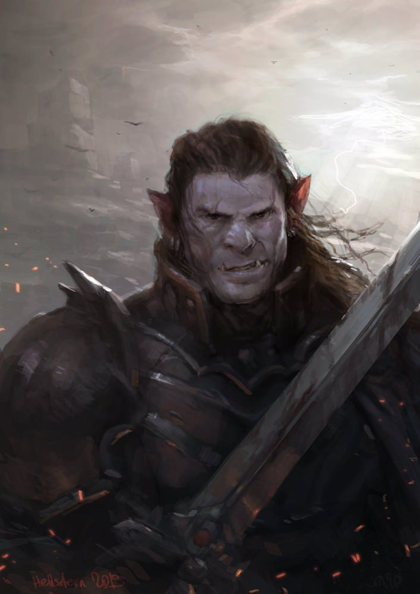

|  | 
|:--------------------------------------------------------------------------------------------------:|
|                           *Kane, o Meio-Orc*                                                       |

Kane nasceu na condição de escravo do clã de orcs Bloodbathers. Sua mãe era uma humana que foi vítima da violência do grupo. Tão cedo quanto Kane começou a andar ele já precisava trabalhar para o grupo, por vezes carregando bagagens, por outras limpando as latrinas, sendo vítima constante de violência. 

Quando completara 14 anos foi colocado como um dos gladiadores do grupo, lutava e matava outros escravos para a diversão dos orcs, o erro que o clã Bloodbathers cometeu era ter gerado um legítimo mestre da batalha entre seus escravos.

Há dois anos atrás Kane conseguiu quebrar suas correntes e fugir dos orcs. Tão cedo quanto conquistara sua liberdade havia jurado exterminar todos os Bloodbathers do mundo, porém, uma há cerca de três meses atrás uma névoa sinistra o capturou colocando em hiato sua vingança, levando-o ao continente de Badrovia, dominado pela maldição de Strahd, lá ele fez amizade com o caçador de vampiros Rudolf Von Richstein onde atualmente ele toma parte na caçada e procura novos jeitos de se vingar dos Bloodbathers.

