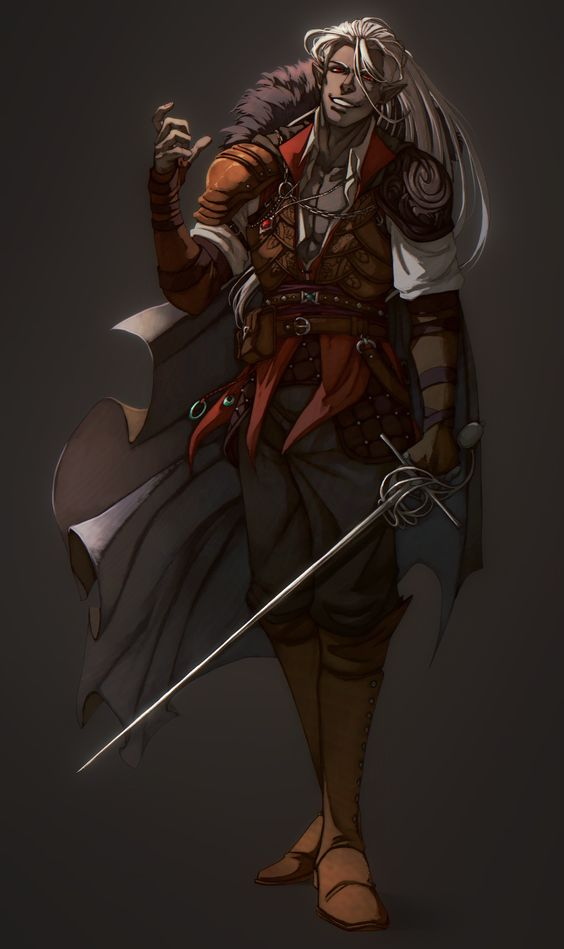

||
|:---:|
| *Ryan Anluin* | 

Me foi contado a certa idade, que a noite que eu nasci tinha sido a noite mais sombria já vista, com uma chuva destruidora, e uma escuridão interminável, e como se não bastasse eu nasci com olhos carmesins, perfeito para ser chamado de aberração entre meus semelhantes. Toda minha infância fui exilado e chamado de monstro, afastado pelos que eu mais amava, meu pai me abandonou aos 10 anos, dizia que eu trazia azar e nunca conseguiria ser alguém, pois todos me odiavam. Não muito depois disso minha mãe se matou e a última coisa que ela disse foi "você nunca deveria ter nascido, você atrai o azar.", após isso eu fiquei completamente sozinho. Passando fome e diversas necessidades diariamente, pois ninguém ajudava alguém chamado de monstro, eu decidi fugir, escapar de minha vila de drows, então assim fiz, arrumei minhas coisas e sai em busca de um lugar no qual seria aceito.

Após viajar por anos e crescer na selvageria, por volta dos meus 35 anos eu acabei encontrando um grande urso das montanhas e acabei ficando encurralado, quando uma figura de grandes cabelos e rapidamente matou o urso, me salvando e logo em seguida se apresentando como Vikor um velho drow de 617 anos e disse que servia a rainha da lua, Nyva, e acabou me convidando para conhecer seus companheiros em seu esconderijo. Ao chegar lá encontro mais três drows, Alak que para um drow era muito musculoso, até estranho, mas uma pessoa com um ótimo coração e possuía 479 anos, Belar um alto e esguio, se auto intitulava o melhor lanceiro já existente e sempre reafirmava isso, e possuía 342 anos, e por último e mais importante Myra, uma jovem de 113 anos, a mais recente seguidora de Nyva ali. Vikor me apresentou a todos, dizendo que eu estava sem casa e pediu para eu contar minha história, e ao conta-la fui aceito por eles lá, no começo não estava afim, pois eram drow, e toda minha vida fui tratado como monstro por eles, porém eles não me viam desse jeito, fui sempre tratado como um semelhante e passei a criar um apreço por eles, e logo aderindo ao pacto dos anciões e me juntando aos Night Watchers, assim me tornando um paladino de Nyva.

Após anos servindo e lutando com meus quatro companheiros, dos quais me ensinaram diversas coisas sobre monstros, por volta de meus 70 anos eu e Myra acabamos nos apaixonando e entrando em um romance, muitos anos depois, Vikor veio a falecer, não por mãos inimigas, mas apenas pelo tempo, sua hora havia chego e o homem que me deu uma nova vida e serviu como o pai que eu não tive se foi e a partir desse dia os Night Watchers se separaram, eu e Myra seguimos nosso caminho enquanto Belar e Alak buscaram espalhar a palavra e pregar o que nossos juramentos dizem, fazer o bem e buscar a luz para o mundo, assim me tornando um caçador de monstros junto de Myra, agora esposa.

Quando cheguei a idade de 179 anos Myra alegremente me contou que teríamos um filho e ficamos muito felizes, porém no momento do nascimento da criança, foi um dia que batia com a descrição do dia em que nasci, porém meu filho sequer chegou a nascer, devido a complicações, ele e Myra faleceram no nascimento e eu não pude fazer nada, apenas ver seu corpo perder o calor e mais uma vez perder alguém que ele amava, por um momento acreditei que fosse um ser amaldiçoado e as palavras de minha mãe ressoaram em minha mente "você nunca deveria ter nascido, você atrai o azar.", porém tudo deveria estar nos planos de Nyva, pois a deusa estava ao meu lado, e segui minha vida como caçador até que onze anos depois eu salvei um jovem chamado Galahad e lutei ao lado de seu pai Castiel, um conhecido de algumas caçadas para derrotar um enxame de Quasit, demônios que conseguem se transformar em morcegos.

Anos depois continuei trabalhando como caçador de monstros, até que um dia reencontrei o garoto Galahad, que agora já era um Diácono, junto com ele havia um homem velho repleto de tatuagens e um ar "feral", ele disse que Castiel havia o enviado para meu encontro e dizia ter uma missão, formar um grupo representante da igreja de Kyn especializados em matar criaturas que ameaçassem a paz, eu prontamente aceitei. Passamos por poucas e boas, muita coisa aconteceu, descobri o motivo do rapaz ser azul e ter chifres, ele na verdade era o que a igreja chama de Hexblood, uma espécie de hibrido entre Hag e homem, além disso o velho homem também tinha suas esquisitices, descobri o motivo pelo qual ele foi preso e a maldição que o cercará, Lycantropia, uma versão diferente da maldição original. Apesar de tudo posso dizer que entre essas "aberrações" eu nunca me senti tão normal e tão em casa...

Depois de um ano e dois meses trabalhando juntos, eu encontrei um contrato em Partali que nos queria em Kahl Lodar e conseguiu lugares em um navio quer cruzaria de um continente ao outro.

