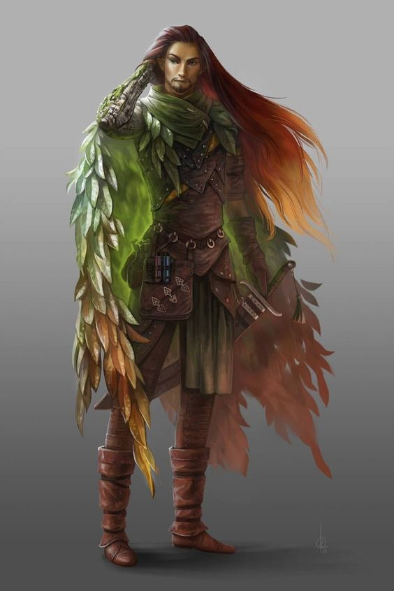

|  | 
|:--------------------------------------------------------------------------------------------------:|
|                           *Vonesuar "O Corvo" Voorc*                                                       |

*"Meu nome é barão Vonesuar Voorc, vim de um plano onde os kenku são abundantes e comandam a principal cidade, Birdsfell. Meu pai, o rei de birdsfell me deu este titulo por te-lo ajudado a manter a paz em Birdsfell de várias formas. Nós descobrimos a existencia de baróvia quando um ser de lá fez contato dizendo ser o dominante deste reino, este era Strahd, o homem que enganou minha família, nos fazendo vir para Baróvia em uma expedição de paz e assassinando meu pai à sangue frio...Hoje eu me aliei aos guardiões das penas, guerreiros de minha raça que também foram enganados pelo maldito vampiro e buscam vingança. Minha família era meu mundo, e não posso ser livre sabendo que o monstro que matou o rei mais honesto de Birdsfell continua vivo e impune..."* 

- Diário de Von, contra-capa. 

Vonesuar Voorc é um druida que, igualmente aos outros aventureiros, acabou sendo engolfado pelas brumas de Barovia ao responderem um chamado do além de um vampiro chamado Strahd. Em sua chegada, acabou sendo atacado por uma grande matilha que o deixou perto de sua morte. Ele foi resgatado pelos Guardiões das Penas, que constataram que apenas repassando sua essência poderiam salvar a vida do rapaz. Eles então o morderam com seu bico, passando a maldição da licantropia de sua casta para ele. Por ser um drúida, ele conseguiu aguentar essa maldição de transformação tranquilamente, e acabou sendo acolhido pelas asas de Davian Martikov. Ele então se junta aos aventureiros quando os mesmos se encontram no Mago dos Vinhos, vinhedo tomado pelos drúidas de Strahd. 

