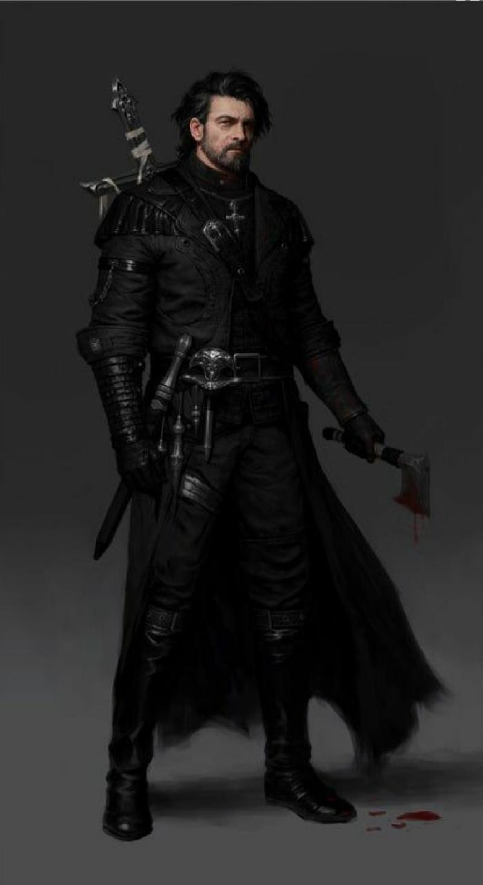

||
|:---:|
| *Detetive "Booker" DeWitt* | 

>Sr. DeWitt? Você não nos conhece, mas temos um serviço para você. Há uma garota em Kahl Lodar, precisamos que você a encontre.
>
>– Os irmãos Lutece.

 

William “Booker” DeWitt é um velho Investigador Particular de Kaville, cidade litorânea
de Partali. Desapegado da vida, Booker é um alcoólatra e viciado em cigarros e ervas
élficas, com fortes tendências suicidas.
Os anos servindo na Guerra não lhe fizeram nada bem – apesar de viver há alguns
anos em Kaville, Booker não lembra boa parte de seu passado.
“Cinquenta anos vividos e tudo que eu consegui nessa vida foi esquecer metade
deles.”

Ele vive próximo a Taverna Mão de Ferro, num casarão bem empobrecido, onde tudo o
que ganha é investido em álcool, ervas e tabaco élfico e na manutenção de suas
armas, estas que ele realiza a manutenção obsessivamente.
Sebastian, dono da Taverna Mão de Ferro é o mais próximo que tem de um amigo –
por ser um cliente fiel, Sebastian concordou que Booker poderia hospedar seus
serviços de Investigação Particular na Taverna em troca de uma taxa de 7,5%.
Após uma carta com o remetente “F&F Lutece Ltd.” chegar com uma oferta de trabalho
para ele, ele se prepara para partir à Kahl Lodar.

