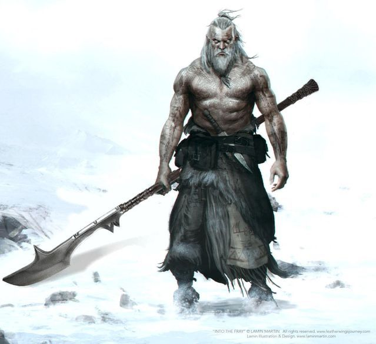
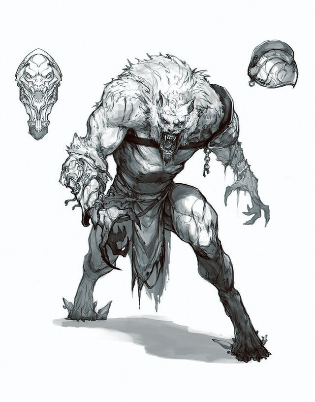

|  | |
|:--------------------------------------------------------------------------------------------------:|:------------------------------------------------------------------------------------------:|
|                           *Yoskolo Frødmundsson*                                                   |                              *"A Fera"*                                |

>Eu nasci há 56 anos atras, em um pequeno conjunto de vilarejos localizado no extremo norte de Quan’go chamado Skaald Villages, minha vila gira entorno da caça e coleta de frutos, tubérculos, pesca e caça de grandes mamíferos. Por conta dos monastérios locais tínhamos que entregar uma parte de nossas coletas para os monges, em troca eles protegiam nossas vilas e auxiliavam em construções e manutenções da vila, porém por conta disso éramos muito pobres. Eu cresci em um lar muito pobre, meu pai era um pescador e minha mãe morreu em meu parto, quando eu tinha 17 anos meu pai faleceu devido uma doença, que Kyn o tenha, com isso as dividas bateram a porta, sempre fui um garoto forte então acabei aderindo a trabalhos como “Thug”, cobrava dividas, ameaçava e espancava pessoas em troca de dinheiro. Com 20 anos o exército veio até os vilarejos para arrecadar contingente para a guerra, grandes sacos de ouro eram oferecidos a aqueles que se alistavam, fora uma aposentadoria gorda, não tive dúvidas me alistei assim que pude.
>
>Durante minha serventia de vinte anos no exército conheci homens muito bons que lutavam por inúmeros motivos uma guerra do qual a causa dela precede o nascimento de cada um de nós, politicas e suas merdas, me pagando nunca me importei pela causa, era bem pago e podia fazer as mais esdrúxulas barbaridades juntamente com o esquadrão composto por seis soldados, incluindo eu existiam outros três skaalds, um aretuzo e um valeno, bons homens, faz tanto tempo que nem lembro mais seus nomes, o pelotão era composto por aproximadamente 20 homens, caminhávamos sobre o comando de um general partaliano Gen. Jamal, um homem velho e severo, mas entendia a questão do quão estupida era aquela guerra. Um dia tínhamos uma missão de invadir uma igreja para buscar um comandante que nos traiu e tinha informações valiosas sobre os cercos inimigos, meus companheiros tinham motivos religiosos ou apenas achavam brutal assassinar um monte de padres, mas aquilo não era um problema para mim na época, então entrei naquele lugar destroçando os padres, minha deusa me perdoe, quando chegou no bispo já no chão sangrando ele apontou para mim e disse algo, eu não prestei atenção no que ele disse e apenas o finalizei como era cotidiano, como fui tolo.
>
>Depois disso voltamos para o acampamento para descansarmos, em poucos dias eu adoeci com uma febre absurda, no quarto dia eu jamais esquecerei o que houve, eu tive uma espécie de convulsão, meu coração pulsou como se fosse sair do meu peito, comecei a suar, meus músculos começaram a se contorcer e meus osso a quebrar, nesse dia foi a primeira vez que eu conheci a Fera, num surto de sede sangue aquela besta saiu matando e devorando os vinte homens que dividiam aquele cômodo comigo, homens bons, homens com mulheres e filhos em casa aguardando eles voltarem do combate, homens esses que nunca voltaram, por minha causa. 
>
>Fui expulso do exército e acusado de traição e de crimes de guerra, além é claro de perceberem que eu era um monstro, fui para cadeia desolado e durante um ano todos os dias aquela fera voltava para me assolar e sua sede vinha com ela, tive que ser enviado a uma prisão solitária, onde eu passava dias sem companhia, até que um clérigo de Kyn, Castiel o Bispo Diocesano, e seu diácono, Galahad Sanguine, um rapaz tiefling curiosamente azul, começaram a fazer companhia, lentamente eles foram me ensinando a controlar as transformações e a palavra da Deusa Kyn, me mostraram que minha maldição é um sinal que devo buscar minha redenção e para isso devo proteger a maior virtude de todas, a vida daqueles que me cercam e com meu juramento jamais tirar a vida de um homem, mulher ou criança. As palavras da minha deusa estão cravadas em minha pele e seus conhecimentos encrustados em minha mente, minha devoção a deusa e sua causa e completa e absoluta. Depois de 15 anos preso, dez anos depois do suposto fim da guerra eu fui solto com um proposito, caçar monstros juntamente com meu velho amigo o garoto Galahad e com o Drow paladino de Nyva Ryan, estamos há um ano e dois meses na estrada, já vivemos algumas poucas, eu boas e confio plenamente em ambos, no último mês recebemos um contrato em Yohan, não vou lá desde a guerra, estou ansioso para ver como está aquela região hoje em dia, mas com medo de quais lembranças aquele lugar pode me trazer, na verdade não estou, não há o que temer, minha deusa estará comigo para me proteger e junto a ela eu sou imbatível.

