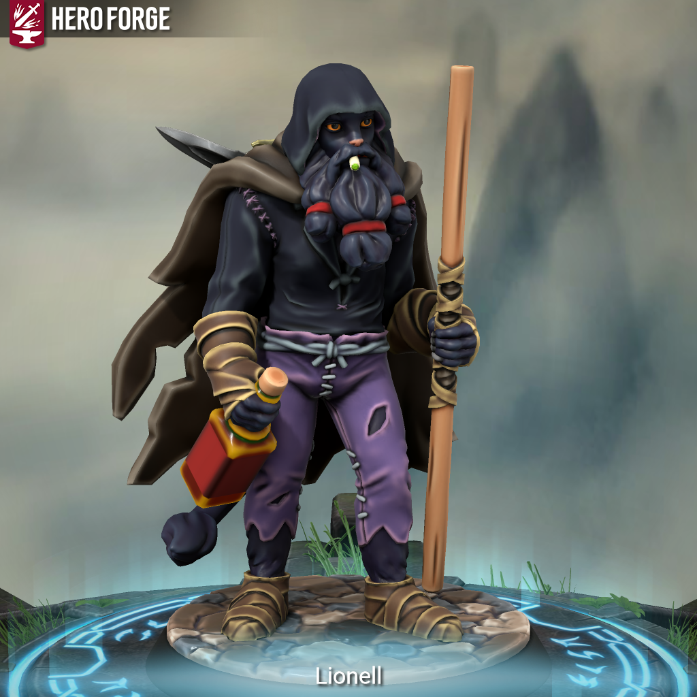

> 
>
> <a href="https://www.youtube.com/watch?v=QoZ8i9Qltvw" target="_blank">"A única coisa curta nessa sala..."</a>
>
> *-Lionell*

Amaldiçoado por uma variação da Lycantropia, sempre teve uma vida complicada, seu pai provavelmente era um lycantropo e sua mãe morreu durante o parto, ainda jovem foi mandado para um orfanato em Quang Go, onde sofreu muito preconceito por sua aparência peculiar, com 10 anos (idade onde shifters atingem a maioridade) aparentava ter 18. 

Quando a primeira Lua cheia do seu 10° aniversário chegou ele se transformou na sua forma completa e com isso sua insanidade é sede de sangue vieram também, nessa noite Lionell matou todos os membros do orfanato enquanto estava transformado, em pânico fugiu, depois de muito caminhar ele achou abrigo nas florestas, indo a cidade apenas para recolher mantimentos, em uma dessas visitas ele viu um pôster de recrutamento para a guerra, então com 15 anos (e aparecia de 20 e poucos) ele se alistou. 

Durante a guerra finalmente Lionell pode explorar o seu lado selvagem, seu esquadrão era plenamente para assaltos dando carta branca para matar os seus inimigos para salvar as vidas dos q estavam em perigo, porém Lionell as vezes perdia o controle exagerando na matança, mas o q mais assola Lionell é o fato de ter abraçado quem ele é durante esses eventos, de ter gostado de se sentir na selvageria isso sem falar dos momentos q foi salvo por essa maldição, Lionell durante um tempo achou q sua maldição fosse uma benção, porém tudo isso mudou quando em uma noite de lua cheia ele matou todos os membros do seu esquadrão, todos os amigos q ele tinha, seu companheiros, mortos brutalmente em minutos de um surto, não tiveram nem como se defender. 

Por ajudar a salvar as vidas ele ganhou uma medalha e por tirar a de tantos outros ele foi temido e debandado do exército no último ano da guerra, então ele caiu em desgraça, todo mês sua maldição se repetia, todo estresse a sanguinolência voltava, Lionell desesperado caiu em desgraça, abusando de álcool e drogas hoje ele se encontra como um mendigo em Kiassara, poucos sabem exatamente quem ele é ou oq ele é, toda vez no mês ele foge para as florestas para se transformar.

Apesar de tudo Lionell busca uma forma de se redimir e poder salvar vidas de novo e com isso alcançar a paz em si mesmo antes de partir, todo o ano ele leva flores e divide bebidas no túmulo dos membros de seu esquadrão, um rito de passagem, porém um novo ano se aproxima, será uma chance de Lionell poder finalmente alcançar a sua tão desejada paz?...

