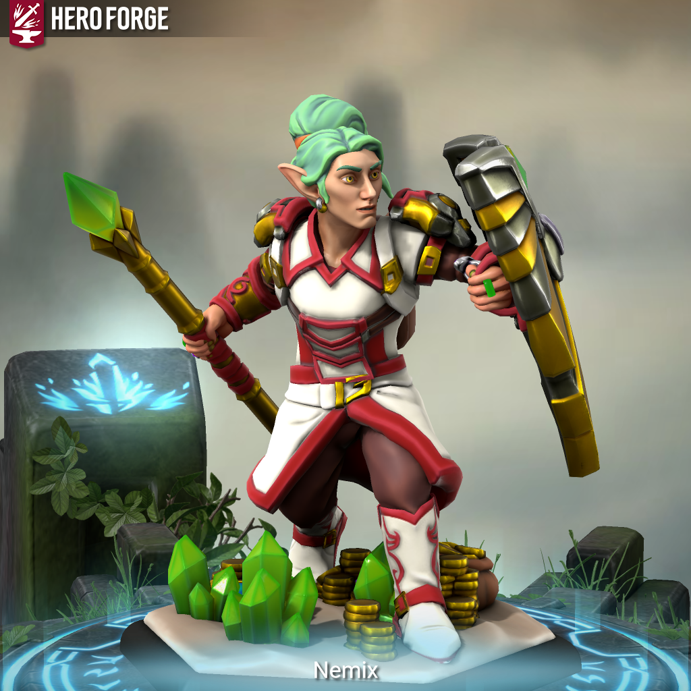

> 
>
> "LABAXURIAS!!!"    
>
> *-Nemix Hoamilion*

Nemix Hoamilion nasceu ao Oeste, na floresta de Kakanega, na tribo dos Superds. São fiéis à Kyn, já que possuem extremo zelo pela vida. Nemix é filho do sumo-sacerdote de sua cidade e sempre se dedicou ao povo e aos ensinamentos de seu Deus, ele não possui irmãos e é muito repreendido por seus pais, apesar de amar eles incondicionalmente. 

Esse amor pela vida em primeiro lugar e sua devoção à igreja o fizeram, antes de virar adulto, cerca dos 85 anos, à virar acólito de sua religião, servindo sua vida e agindo como um intermediário entre o reino do sagrado e do mundo mortal, fazendo ritos sagrados e oferecendo sacrifícios para guiar os fieis à presença do divino. Nemix não possui inimigos em sua cidade e, mesmo que algumas criaturas possam vê-lo como, ele tenta simpatizar com todos. Seu trabalho é mundialmente conhecido, visto os anos que se passaram, como uma pessoa a se admirar. Sua religião e doações lhe sustentam em um estilo de vida Modesto.
 
Nemix aos 115 anos declarou-se como adulto, continuou estudando, tanto que aprendeu o idioma primordial, e igualmente a servir à vida, sempre cuidando dos enfermos e dos necessitados. Aos 180 anos, nosso Clérigo da Vida sentiu um chamado de Kyn para se desprender de sua vila, e assim curar mundo afora. Passou por diversas vilas espalhando seu legado, fazendo muitas delas até construírem templos para Kyn, chegando, 5 anos depois de sua partida, à Nova Strad, capital de Aretuza, uma grande potência mercantil do Oeste, onde sua aventura começa...