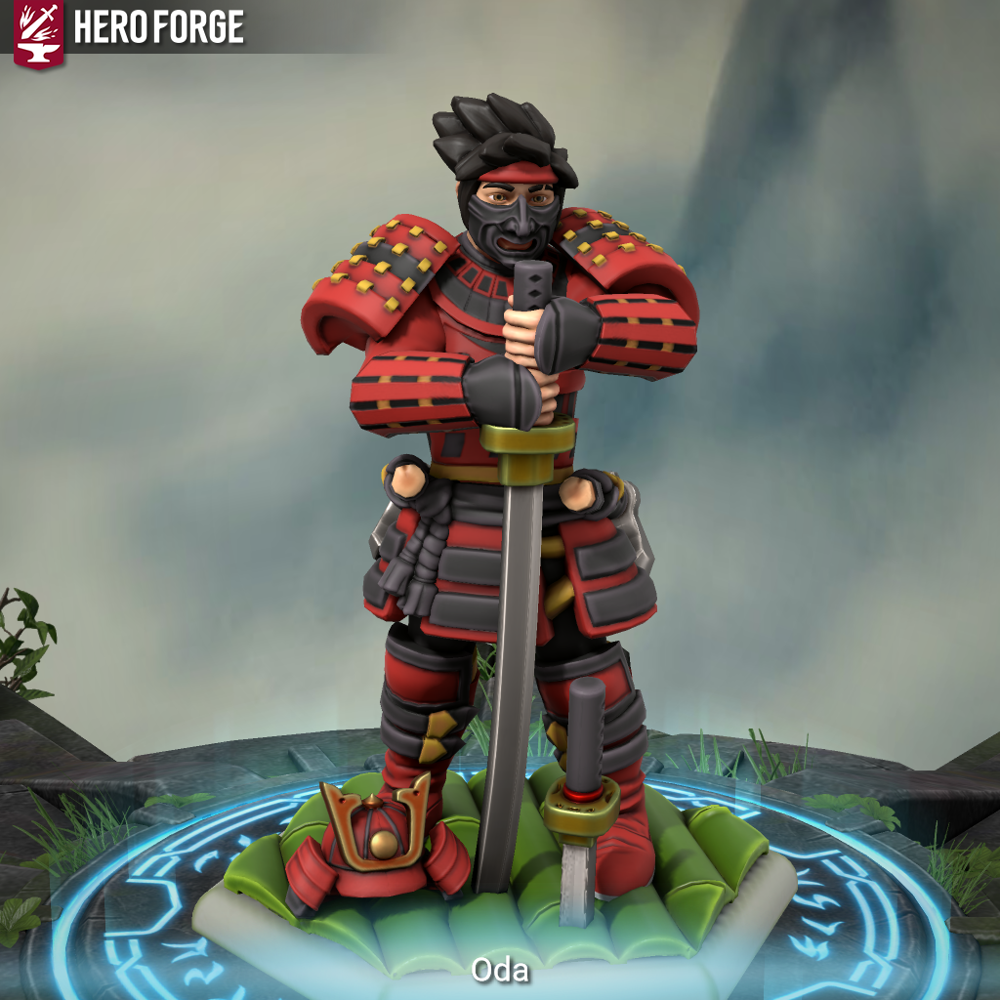

> 
>
> "A Tradição se mantem. Os samurais retornarão." 
>
> *-Oda*

O ápice dos Samurais se deu nos períodos de Guerra. A estatégia e disciplina desses guerreiros era tão impecável que cada Samurai valia por cem de seus inimigos. 

Oda... talvez valesse por mil. 

Vindo das partes mais remotas dos Monastérios, Oda era o mais disciplinado e equilibrado de todos os recrutados de sua classe. Técnica e estratégia eram o foco, mas que também compartilhavam espaço com força e sabedoria, criavam a receita de um guerreiro samurai a beira do impecável. 

Com os acordos de paz entre os reinos, os Samurais perderam sua principal função na sociedade. Alguns, buscando motivações para continuar seus caminhos, viraram mercenários e assassinos de aluguel. Foi o início do fim para os clãs Samurais... mas não para um homem. 

Oda hoje busca reunir aqueles que ainda seguem o caminho original dos Samurais, recriar a família que perdeu na queda e reestruturar a honra dos Clãs Samurais. 

