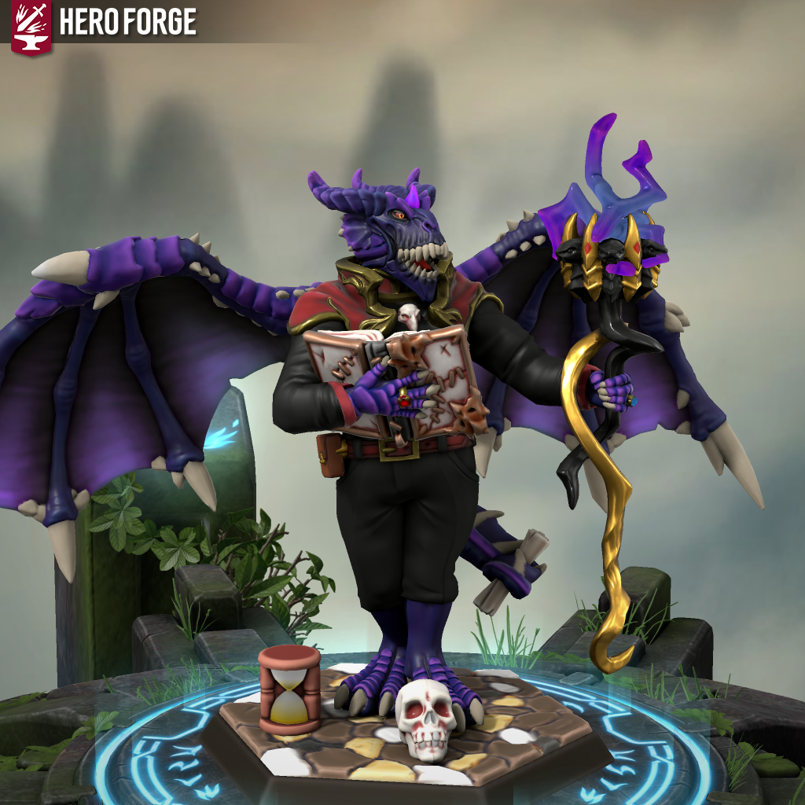

> 
>
> "Ph'nglui mglw'nafh Cthulhu R'lyeh wgah'nagl fhtagn" 
>
> *-Odahviing*

Vindo do Oeste, mais precisamente sua capital Novistrad, Odaviing é um draconato, professor do mais alto escalão na Universidade de magia de Novistrad (U.M.N.S), formado na escola de cronurgy, é um exímio especialista do espaço tempo. Mas todo esse poder vem de um enorme segredo. 

Odaving ainda muito jovem descobriu seu ancestral parentesco com um lendário dragão conhecido pela alcunha de “The great dreamer”, também chamado de Cthulhu, um ser oriundo do mais profundo vazio que existe na fenda dimensional entre o tempo e o espaço. O draconato descobriu uma forma de se conectar com o lendário dragão, através de seu extraplano “Soul Cairn”, Odaving conseguiu infindo conhecimento agregando o controle do tempo e espaço ao seu novo grimório, o Necronômicon, ou, livro dos mortos.

Utilizando-se deste conhecimento, Odaviing cresceu rapidamente na vida acadêmica, se desempenhando excepcionalmente bem, já que detinha os controles do tempo, podendo retornar ao passado e tomar novas escolhas, decidir novos caminhos.

Sempre ansiando por novas aventuras Odaviing se aventura atrás de conhecimento seguindo a tutoria de seu ancião Cthulhu, ouvindo seus segredos atemporais, ouvindo seus sussurros de conselhos, e deleitando-se nos mais profundos sonhos, cujos quais os humanos nem passam perto no que chamam de dormir.

