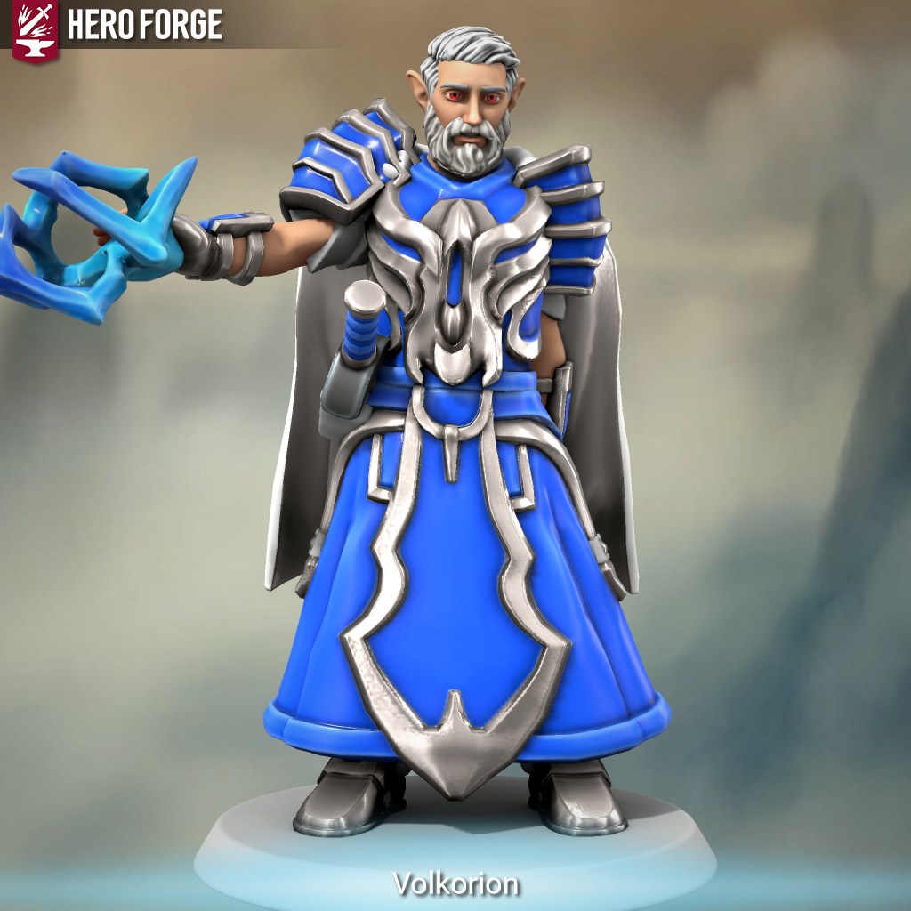

> 
>
> "Eu vou encontrar aquele que me amaldiçoou com esse poder." 
>
> *-Volkorion*

Volkorion foi concebido sem pai e com um imenso poder divino dentro de si. Volkorion cresceu como uma aberração e se sentiu triste por diversos anos, mas depois de atingir sua maturidade entendeu que o problema era seu imenso poder.

Volkorion então teve uma imensa explosão dentro de si, que divindade poderia ter feito isso? Volkorion então vai atrás de respostas esnobando a todos por conta de seus poderes mas com um ódio em seu coração e apenas um objetivo. Se tornar o ser mais poderoso existente custe o que custar e encontrar essa divindade e destrui-la.

Pois ele não teve a escolha de receber este poder, mas vai aumentá-lo com a morte desta divindade, custe o que custar. 